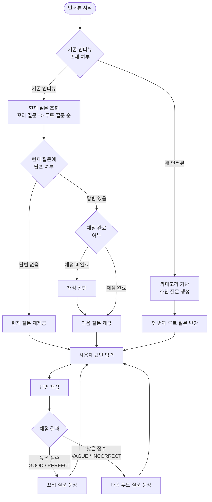

# Project Introduction

## Motivation

> “어떻게 하면 학습한 내용을 잊어버리지 않고 오래 기억할 수 있을까?”

학습 과정에서 가장 어려운 점은
단순히 내용을 이해하는 것이 아니라,
시간이 지나도 다시 꺼내 쓸 수 있도록 기억에 남기는 것이라고 생각했습니다.

해당 프로젝트는 공부한 내용을 직접 질문으로 만들고,

답변을 통해 스스로 이해도를 점검하며,

부족한 부분을 반복적으로 학습할 수 있도록 돕는 것을 목표로 시작되었습니다.

---
## About the Project

해당 프로젝트는 문제 기반 학습과 인터뷰 형식의 반복 학습을 결합한
학습 기록 및 자동 채점 플랫폼입니다.

사용자는 학습한 내용을 문제로 정리하고,
인터뷰 형식으로 답변하며,
채점 결과와 점수를 통해 자신의 약점을 인식하고 보완할 수 있습니다.

### 1. 문제 작성

사용자는 학습한 내용을 기반으로 문제(질문)를 직접 작성합니다.

문제에는 인터뷰 채점에 사용할 모범 답변(reference answer)을 함께 정의합니다.

작성된 문제는 관리자 리뷰를 거쳐 승인되며,

승인 전에는 PRIVATE, 승인 후에는 PUBLIC 상태로 전환되어 다른 사용자와 공유됩니다.

### 2. 문제 관리

사용자는 자신이 작성한 문제를 조회하고 관리할 수 있습니다.

문제는 개인 학습용(PRIVATE)과 서비스 공용(PUBLIC)으로 구분됩니다.

### 3. 인터뷰 & 채점
인터뷰 플로우

사용자는 학습한 내용을 인터뷰 형식으로 진행할 수 있습니다.

인터뷰 중 제출한 답변은 채점 시스템을 통해 평가됩니다.

#### 채점 방식

제출한 답변은 Gemini 기반 채점 로직을 통해 평가됩니다.

- 모범 답변과 사용자 답변을 비교해 등급(예: PERFECT, GOOD, VAGUE, INCORRECT)을 산정합니다.
- 답변의 부족한 부분을 보완할 수 있도록 피드백을 생성합니다.
- 채점 결과는 후속 꼬리질문 난이도 선택과 카테고리 점수 산정에 활용됩니다.

채점 결과는 문제의 카테고리별 점수로 기록되며,

이 점수는 사용자의 부족한 영역을 파악하는 데 사용되고

이후 인터뷰에서 문제 추천 시스템의 입력 값으로 활용됩니다.

인터뷰가 종료된 후에는 다음 정보를 다시 확인할 수 있습니다.

- 질문과 답변 내용
- 채점 점수
- 답변에 대한 피드백

또한 인터뷰에서는 서비스에서 기본 제공하는 문제(PUBLIC)와 사용자가 직접 작성한 문제(PRIVATE)를
혼합하여 제공함으로써 학습 범위를 확장합니다.

### 4. 마이 페이지

사용자는 카테고리별 점수를 한눈에 확인할 수 있습니다.

예: 컴퓨터 공학, 백엔드, 시스템 설계 등

각 카테고리를 선택하면 하위 카테고리 점수를 확인할 수 있습니다.

예: 컴퓨터 공학 → 네트워크, 데이터베이스

이를 통해 학습 강점과 약점을 직관적으로 파악할 수 있습니다.

## Project Structure
해당 프로젝트는 Spring 기반 웹 애플리케이션을 중심으로 구성되어 있습니다.

Spring 서버는 웹 뷰 제공, 비즈니스 로직 처리, 인터뷰 진행, 문제 관리, 채점 결과 반영을 담당합니다.

답변 평가는 서버 내부의 Gemini 연동 채점 흐름을 통해 처리됩니다.

### Documentation

👉 [Spring API Server](./learn-hub/README.md)

## How to Run

전체 서비스는 Docker Compose를 통해 실행할 수 있습니다.

1. '.env-ex' 파일의 값을 채우고 '.env' 로 파일 이름 변경

2. 프로젝트 루트에서 아래 명령어 수행

    - `docker compose --profile test up -d`

각 서버의 세부 실행 방법 및 환경 설정은
하위 README를 참고하세요.
