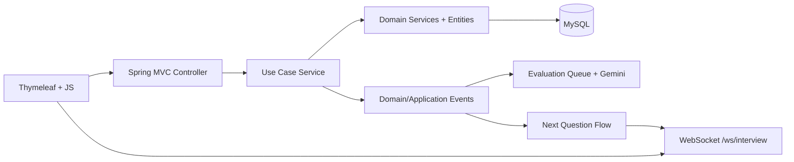
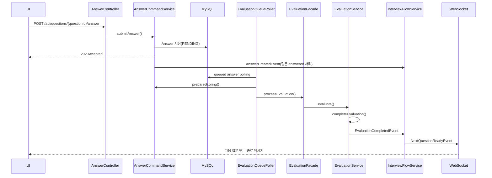

# Architecture And Code Style

## 목적

이 문서는 현재 `javis` 리포지토리의 실제 구조를 기준으로 아키텍처와 코드 스타일을 정리한 기준 문서다.
설계 의도뿐 아니라 현재 코드에서 반복되는 패턴과 운영 시 주의할 점까지 함께 기록한다.

## 리포지토리 구조

루트 디렉터리는 서비스 실행, 운영 보조 자산, 성능 실험 문서를 함께 포함한다.

- `learn-hub`
  Spring Boot 기반 메인 서비스. 실제 사용자 기능, 관리자 기능, 채점, 인터뷰 흐름이 여기에 있다.
- `docs`
  인터뷰 흐름, 비동기 채점, 성능 튜닝, 장애 대응 문서가 누적되어 있다.
- `mock-evaluator`
  채점 연동을 대체하거나 실험할 때 사용하는 보조 모듈로 보인다.
- `monitoring`
  Prometheus, Grafana 설정이 있다.
- `mysql`
  DB 실행 및 설정 보조 파일이 있다.
- `scripts`, `k6-scripts`
  로컬 운영 및 부하 테스트 스크립트가 있다.

현재 서비스 아키텍처의 중심은 `learn-hub`이며, 나머지는 이를 둘러싼 실험 및 운영 자산이다.

## 런타임 아키텍처

`learn-hub`는 다음 요소로 구성된다.

- Spring MVC + Thymeleaf
  서버 렌더링 페이지와 일부 JS 기반 상호작용을 제공한다.
- REST API
  문제, 인터뷰, 점수, 리뷰, 관리자 기능을 `/api` 하위로 노출한다.
- WebSocket
  인터뷰 중 다음 질문과 종료 이벤트를 비동기로 전달한다.
- MySQL + JPA
  인터뷰, 질문, 답변, 문제, 점수, 리뷰를 영속화한다.
- Spring AI / Gemini
  사용자 답변 채점을 수행한다.
- Async + Scheduler
  채점 큐 폴링, 복구, 다음 질문 생성, 메시지 전송을 비동기로 처리한다.

### 상위 흐름

## `learn-hub` 패키지 구조

최상위 패키지는 `com.javis.learn_hub` 아래에 도메인 단위로 분리되어 있다.

- `answer`
  답변 생성, 채점 상태 전이, 채점 큐 진입
- `category`
  카테고리 경로와 점수 트리 구성
- `evaluation`
  Gemini 채점, 재시도, 완료 처리
- `interview`
  인터뷰 시작, 재개, 다음 질문 결정
- `member`
  사용자와 권한
- `problem`
  문제, 꼬리 문제, 모범 답안, 추천
- `review`
  문제 공개 전 리뷰
- `score`
  카테고리별 점수 계산과 조회
- `admin`
  관리자 페이지/API
- `event`
  도메인/애플리케이션 이벤트 정의
- `support`
  공통 인증, 예외, 페이징, 설정, 웹소켓, 페이지 컨트롤러

### 모듈 내부 계층

대부분의 도메인은 아래 패턴을 따른다.

- `presentation`
  HTTP 진입점. 요청 파싱과 응답 포맷 담당
- `service` 또는 `application`
  유스케이스 조립, 트랜잭션 경계, 이벤트 발행 담당
- `domain`
  엔티티, 값, 도메인 규칙
- `domain/service`
  Reader, Finder, Processor, Recommender 같은 역할 분리형 도메인 서비스
- `domain/repository`
  JPA repository
- `infrastructure`
  Gemini, JWT, OAuth 같은 외부 의존

주의할 점은 유스케이스 계층 이름이 완전히 통일되어 있지는 않다는 것이다.

- 대부분은 `service`
- `evaluation`, `support` 일부는 `application`

현재 기준에서는 모듈 안에서 기존 이름을 따르는 것이 안전하다. 새 기능을 넣을 때 같은 책임에 `service`, `application`을 동시에 추가로 늘리지 않는 것이 좋다.

## 핵심 도메인 흐름

### 1. 문제 작성과 공개

1. `ProblemController`가 요청을 받는다.
2. `ProblemCommandService`가 DTO를 커맨드로 변환한다.
3. `ProblemProcessor`가 `Problem`, `ProblemScoringInfo`, 꼬리 문제를 재귀적으로 생성한다.
4. 리뷰 승인 전에는 `Visibility.PRIVATE`, 관리자 등록은 `PUBLIC`을 사용한다.

특징:

- 문제 내용과 모범 답안은 별도 엔티티로 나뉜다.
- 꼬리 문제는 `parentProblemId`로 트리 구조를 이룬다.
- 카테고리는 `computer_science:network` 같은 경로 문자열을 기준으로 생성된다.

### 2. 인터뷰 시작과 재개

1. `InterviewController`가 `mainCategory`를 받아 시작 API를 호출한다.
2. `InterviewFlowService`가 기존 활성 인터뷰 존재 여부를 판단한다.
3. 새 인터뷰면 `InterviewProcessor.initInterview`가 추천 문제를 뽑고 루트 질문 스냅샷을 만든다.
4. 재접속이면 `InterviewStepFinder`가 미완료 질문, 채점 대기 상태, 다음 질문 진행 필요 여부를 판별한다.

특징:

- 인터뷰는 `MainCategory` 기준으로 시작한다.
- 실제 질문은 `Problem`의 스냅샷 역할을 하는 `Question` 엔티티로 저장된다.
- 재접속 시 이어하기 로직이 이미 구현되어 있다.

### 3. 답변 제출, 채점, 다음 질문

현재 서비스의 가장 중요한 비동기 체인은 아래와 같다.

특징:

- 답변 제출은 동기 채점이 아니라 `202 Accepted` 후 비동기 처리다.
- 채점은 스케줄러 기반 폴링 + 전용 executor로 수행된다.
- 완료 후 다음 질문은 `AFTER_COMMIT` 이벤트로 이어진다.
- 사용자에게는 WebSocket으로 진행 상황이 전달된다.

## 현재 구조에서 좋은 점

- 도메인 경계가 비교적 명확하다.
- 인터뷰와 채점 흐름이 이벤트 기반으로 분리되어 있어 응답 지연을 줄이기 좋다.
- `Question`이 `Problem`의 스냅샷이기 때문에 인터뷰 중 원본 문제가 수정돼도 흐름을 유지하기 쉽다.
- `Association<T>`로 연관 ID를 감싸 직접 연관 대신 ID 중심 모델링을 유지한다.
- 테스트가 도메인 서비스 단위로 비교적 촘촘하다.

## 현재 구조에서 주의할 점

- 표시용 문자열이 여러 계층에 흩어져 있다.
  `PageController`, `InterviewHistoryResponse`, `InterviewStartPolicy`, 템플릿, JS, 예외 메시지, Gemini 프롬프트에 각각 하드코딩이 있다.
- 공통 예외 체계가 아직 얕다.
  `GlobalExceptionHandler`는 일부 예외만 처리하며, 예외 메시지 자체가 사용자 문구 역할을 겸한다.
- SSR 템플릿과 JS가 강하게 결합되어 있다.
  페이지 내부 스크립트가 직접 문구와 API를 들고 있어 다국어 적용 시 치환 지점이 많다.
- 유스케이스 계층 패키지 명이 혼재한다.

## 코드 스타일

### 1. 패키지 기준은 기술 계층보다 도메인 우선

새 코드는 먼저 어느 도메인에 속하는지를 정하고, 그 안에서 계층을 나눈다.
공통화가 필요하더라도 성급하게 `common` 패키지로 빼기보다 도메인 안에 두는 경향이 강하다.

### 2. 컨트롤러는 얇게 유지

컨트롤러의 역할은 다음 수준에 머문다.

- 요청 DTO 수신
- 인증 사용자 추출
- 서비스 호출
- HTTP 응답 조립

도메인 판단, 추천, 상태 전이는 서비스나 도메인 서비스로 내려간다.

### 3. 유스케이스 계층이 트랜잭션 경계를 가진다

- `@Transactional`은 주로 `service`/`application` 클래스에 위치한다.
- 도메인 서비스는 순수 규칙과 협력을 담당하고, 트랜잭션 경계는 상대적으로 바깥에 둔다.

### 4. 도메인 서비스 역할을 세분화한다

현재 코드에는 아래 이름 패턴이 반복된다.

- `Reader`
  단건 조회, 존재 보장 조회
- `Finder`
  여러 엔티티를 묶는 조회
- `Processor`
  생성, 상태 변경, 삭제
- `Recommender`
  추천/선택 로직

새 기능도 이 패턴을 따르면 기존 코드와 읽는 방식이 맞아진다.

### 5. DTO는 `record`를 선호

요청/응답 DTO는 간결한 `record` 형태가 많다.
상태와 행위가 필요한 객체는 일반 클래스로 둔다.

### 6. 엔티티는 명시적 갱신 메서드를 가진다

엔티티는 setter를 열지 않고 다음 형태를 사용한다.

- `update(...)`
- `publish()`
- `markAnswered()`
- `success()`, `fail()`, `requeue()`

상태 전이 규칙은 엔티티 또는 enum 내부로 모으는 편이다.

### 7. 식별자 직접 참조를 적극 사용

JPA 연관관계 대신 `Association<T>` + converter를 사용해 ID 참조를 명시적으로 저장한다.
이 방식은 조회 제어가 쉽고 의존 방향이 단순하지만, 화면용 조합 조회는 Finder 계층이 담당해야 한다.

### 8. 테스트 스타일

- `@DisplayName`을 적극 사용한다.
- 테스트 설명은 한국어 중심이다.
- 도메인 단위 테스트가 많고, 지원용 builder 및 in-memory repository를 사용한다.

## 새 코드 작성 가이드

현재 코드 스타일에 맞추면 아래 원칙이 가장 안전하다.

- 새 유스케이스는 먼저 해당 도메인 하위에 배치한다.
- 표시용 문구는 엔티티나 DTO에 직접 넣지 않는다.
- 사용자 문구와 비즈니스 규칙 메시지를 분리한다.
- 조회와 변경이 함께 있으면 `Reader/Finder`와 `Processor`로 나눈다.
- 외부 연동은 `infrastructure`에 둔다.
- 비동기 후속 작업은 가능하면 이벤트로 분리한다.

## 다국어 기능 관점에서 중요한 구조적 사실

현재 구조는 다국어 확장에 유리한 점과 불리한 점이 동시에 있다.

유리한 점:

- `MainCategory.path`, `Category.path`가 이미 영어 slug 기반이라 언어 비의존 식별자로 쓸 수 있다.
- 문제 추천과 인터뷰 진행이 UI와 분리된 도메인 흐름을 가지고 있다.
- 채점 결과의 등급(`PERFECT`, `GOOD`, `VAGUE`, `INCORRECT`)이 안정적인 코드값이다.

불리한 점:

- 표시명과 오류 문구가 각 계층에 분산되어 있다.
- `Problem`, `Question`, `ProblemScoringInfo`에 콘텐츠 언어 정보가 없다.
- Gemini 프롬프트가 한국어 기준으로 고정되어 있다.

이 때문에 다국어는 단순 템플릿 번역이 아니라, UI locale과 콘텐츠 language를 분리하는 방향으로 설계해야 한다.
